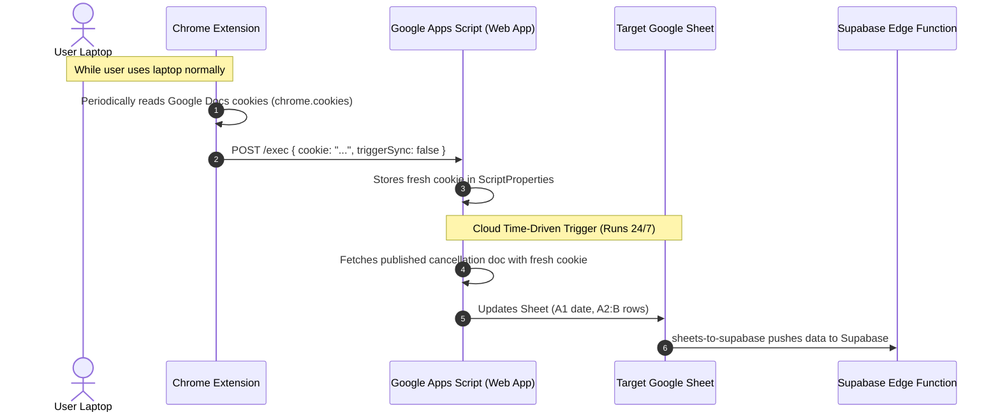

# BCA Absence Sync Cookie Tool

A lightweight Manifest V3 Chrome Extension that automatically syncs Google Docs session credentials to your **BCA Absence Sync** Google Apps Script.

This keeps your cloud Apps Script running 24/7 in Google's cloud without requiring your computer to stay on constantly or manually extracting cookies when sessions expire.

---

## How It Works



1. While you use Chrome on your laptop, the background service worker extracts your active `@bergen.org` session cookies for Google Docs.
2. The extension sends an HTTP POST request to your Google Apps Script Web App endpoint (`doPost`).
3. Google Apps Script stores the cookie in `ScriptProperties` under `DOC_COOKIE`.
4. The 5-minute time-driven trigger in Apps Script runs autonomously in Google's cloud 24/7 using the updated cookie.

---

## Setup & Installation

### Step 1: Deploy Apps Script Web App
1. In your Google Sheet, open **Extensions** > **Apps Script**.
2. Ensure `doc-to-sheets/Code.gs` is updated with the `doPost` and `doGet` handlers.
3. In the top right corner, click **Deploy** > **New deployment**.
4. Click the gear icon (Select type) and choose **Web app**.
5. Configure the deployment:
   - **Description**: `BCA Cookie Sync Endpoint`
   - **Execute as**: `Me (your email)`
   - **Who has access**: `Anyone` *(recommended so the Chrome extension can reach it without OAuth redirects)*
6. Click **Deploy**.
7. Authorize the permissions when prompted.
8. Copy the generated **Web app URL** (format: `https://script.google.com/macros/s/.../exec`).

*(Optional)*: If you want to protect your Web App with a secret key, go to **Project Settings** > **Script Properties**, add property `SYNC_SECRET` with any secret password, and put the same password in the extension settings.

---

### Step 2: Install Chrome Extension
1. Open Google Chrome and navigate to `chrome://extensions`.
2. In the top right, turn **Developer mode** **ON**.
3. In the top left, click **Load unpacked**.
4. Select the directory:
   ```
   /Users/kabirsekhon/Documents/Coding/bcaway/chrome-cookie-tool
   ```
5. Pin the **BCA Absence Sync Cookie Tool** icon to your Chrome toolbar.

---

### Step 3: Configure and Test
1. Click the **BCA Absence Sync** extension icon in your Chrome toolbar.
2. The popup will open. Paste your **Apps Script Web App URL** into the settings.
3. Click **Save Configuration**.
4. Click **Sync Cookie Now**.
5. You should see a green **"Synced"** badge and a confirmation message.
6. Check your Google Sheet to verify the date in `A1` and cancellations in `A2:B` have updated!

---

## Verification & Status Check

- **Health Check**: You can visit your Web App URL in your browser to verify it is running:
  ```json
  {
    "status": "ok",
    "service": "BCA Absence Sync Web App",
    "hasActiveCookie": true,
    "cookieUpdatedAt": "2026-09-25T20:30:00.000Z",
    "requiresSecret": false
  }
  ```
- **Automatic Sync**: The extension automatically refreshes the cookie every 30 minutes (customizable in popup) and on browser startup whenever Chrome is active.
